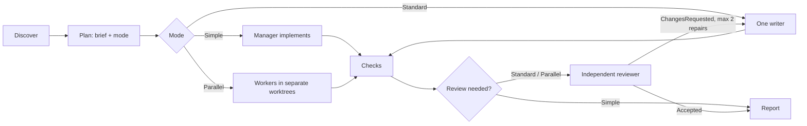

# Lemmings


Lemmings turns a coding request into a checked repository change. You describe the outcome to your agent. The agent acts as the manager: it scopes the work, implements it or hands it to workers, has an independent reviewer check the result when the risk calls for it, and reports the evidence. Small changes stay small.

The whole process lives in one skill, [`skills/lemmings/SKILL.md`](skills/lemmings/SKILL.md), and works without Python. An optional standard-library helper covers what an agent should not improvise: isolated worktrees, scope checks, and running a role on another host CLI.

## Current release: 6.5.0

Lemmings 6.5 removes the schema-v5 runtime. That runtime had Task/Phase/Review JSON artifacts, a lifecycle state machine, revisions and digests, invocation budgets, hooks, and provider discovery. The workflow itself is unchanged: scope, plan, implement, independent review, and proportional modes. The Python part shrank from about 13.6k lines to about 700. Hooks no longer run on every tool call. There is no migration path. Replace the old bundle and delete old `docs/tasks/*.task.json` files and `<git-common-dir>/lemmings/active.json` if they exist. See [the release notes](Documentation~/releases/6.5.0.md).

## How it works



| Mode | Use it for | Process |
| --- | --- | --- |
| **Simple** | One low-risk area | The manager changes the code and runs the checks. |
| **Standard** | Medium risk, a public contract, or wider validation | One writer, then one independent read-only reviewer. |
| **Parallel** | Independent pieces with separate owned paths | One worker per worktree, a complete wave, review of each piece, and checks on the merged result. |

The reviewer blocks only on P0–P2 findings, each with a concrete failure scenario. P3 findings are follow-ups. A task gets at most two repair rounds before the manager reports the blocker.

### Tasks and assignment

Lemmings creates no task files. The manager (the agent you talk to) holds the task and writes a short Markdown **brief**, which is the only task contract:

```markdown
Goal: <one sentence>
Acceptance:
- <observable criterion>
Owned paths: <paths/globs the writer may change>
Checks: <commands or manual checks that can falsify the change>
Risks: <material risks, each with the check that covers it>
Context: <up to ~10 files/symbols worth reading first>
```

The manager assigns a brief to a role:

- **Simple**: the manager does the work itself.
- **Standard**: one `lemmings-worker` (or the manager) implements, then a separate `lemmings-reviewer` gets the brief and the commit range `<base>..<head>`.
- **Parallel**: each worker gets its own brief, its own branch `task/<slug>`, and its own worktree.

Which host and model run a role comes from `.agents/lemmings.json` (see [Cross-host routing](#cross-host-routing)). Workers get the brief, not the conversation. They commit on their branch and report the status, commit, changed paths, check results, and risks. Reviewers answer `VERDICT: Accepted` or `VERDICT: ChangesRequested` with findings.

State lives in the conversation and in Git: `task/*` branches and commits, the workspace registry in `<git-common-dir>/lemmings/workspaces.json`, and dispatch logs in `<git-common-dir>/lemmings/runs/`. Work that must survive a session gets one note, `.lemmings/<slug>.md`, with the brief, the current stage, the verdict, and the blockers. There is no task queue, status machine, or automatic resume.

### Decomposition and execution

The manager decomposes the work in the Plan stage, following the rules in `SKILL.md`:

- Split only at real ownership boundaries. Connected changes (shared files or a shared contract) stay with one sequential writer.
- Run pieces in parallel only when their owned paths do not overlap. Each piece gets its own brief, branch, and worktree.
- Resolve any ambiguity that could change correctness or scope before code is written, by asking the user or by sending the plan to a reviewer.

A Parallel run, for example two independent modules:

1. `lemmings workspace create slug` and `lemmings workspace create money` create worktrees on `task/slug` and `task/money`.
2. The manager dispatches both workers (one wave) and waits for **every** worker before integrating anything.
3. For each branch: `lemmings scope --base <sha> --owned ...`, then an independent review. On `ChangesRequested`, only the blocking findings go back to the same worker, for at most two rounds.
4. Accepted branches are merged one at a time. The checks run on the merged result, and the worktrees are removed.

Standard is the same flow with one writer. Simple skips delegation and review.

## Install

### Claude Code plugin

```text
claude plugin marketplace add UnioGame/unigame.ai.lemmings
claude plugin install lemmings@unigame-ai
```

For a local checkout, use `claude --plugin-dir .`. The plugin provides `/lemmings:lemmings` and the `lemmings-worker`, `lemmings-reviewer`, and `lemmings-explorer` agents.

### Codex or a repository-local install

From this package, with Python 3.10+:

```text
python skills/lemmings/scripts/install.py --repo <your-repository>
./scripts/install.sh --repo <your-repository>
./scripts/install.ps1 -Repo <your-repository>
```

This copies the skill to `<repo>/.agents/skills/lemmings` and the Codex agents to `<repo>/.codex/agents/`. If the install fails, it restores the previous files. Without Python, copy `skills/lemmings/` and the matching files from `agents/` yourself.

## Using it

Ask your agent to use Lemmings and state the result you want, with observable acceptance criteria. You can name a mode ("use Lemmings Parallel") or leave it to Auto.

Optional helper commands:

```text
python .agents/skills/lemmings/scripts/run.py doctor
python .agents/skills/lemmings/scripts/run.py workspace create <slug>
python .agents/skills/lemmings/scripts/run.py scope --base <sha> --owned src/feature
python .agents/skills/lemmings/scripts/run.py dispatch reviewer --brief brief.md --host claude --model opus
```

See [references/helper.md](skills/lemmings/references/helper.md) for details.

## Cross-host routing

By default, each role runs as a native subagent of the host you are working in, using that host's default model. To run a role elsewhere, for example Claude reviewing work managed in Codex, assign it in `.agents/lemmings.json`:

```json
{
  "roles": {
    "reviewer": {"host": "claude", "model": "opus", "effort": "high",
                 "fallback": [{"host": "codex", "model": "gpt-5.6-sol"}]}
  }
}
```

`lemmings dispatch` starts a fresh session of the target CLI (`codex exec`, `claude -p`, or `opencode run`) with that CLI's own login and configuration. It enforces read-only access for reviewers and explorers and applies a deadline. It records the run under `<git-common-dir>/lemmings/runs/` and checks which model actually answered. A model mismatch is reported as an error. Fallback routes are used only when a CLI is missing, fails, or times out.

## Game projects

Engine rules for Unity, Unreal, Godot, Defold, Flutter, Phaser, and PixiJS live in [`skills/lemmings/rules/`](skills/lemmings/rules/). `workspace estimate` includes the Unity `Library` that a new copy will rebuild. Workspaces above 10 GiB need your approval. See [game-projects.md](skills/lemmings/references/game-projects.md).

## Telemetry

Telemetry is offline and optional. It never runs during the task and never adds a per-tool-call cost.

| Source | Recorded in | Read by |
| --- | --- | --- |
| Cross-host runs (`lemmings dispatch`) | `<git-common-dir>/lemmings/runs/<id>/result.json`: role, host, requested and observed model, verdict, tokens, time, fallback | `lemmings-telemetry` |
| Native subagents (the default) | Only the host's own transcripts (Claude Code `~/.claude/projects/`, Codex `~/.codex/sessions/`) | Not yet summarized |
| Benchmark runs | `observation.json` in the benchmark repository | `lemmings_bench report` |

[`packages/lemmings-telemetry`](packages/lemmings-telemetry/) summarizes dispatch run logs by role, host, and model: runs, failures, model mismatches, fallbacks, verdicts, time, and tokens.

```text
pip install ./packages/lemmings-telemetry
lemmings-telemetry --repo . --days 30
```

When every role is native, this package currently has nothing to report. Parsing host transcripts is on the [roadmap](Documentation~/tasks/ROADMAP.md).

## Development

```text
python -m pytest -q
python scripts/build_agents.py        # regenerate agents/*.toml from agents/*.md
```

Release notes: [Documentation~/releases](Documentation~/releases/).
