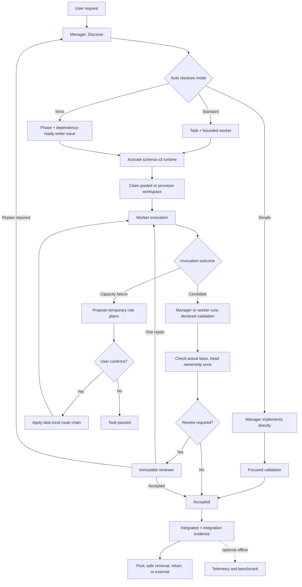

# Lemmings 3.3

Lemmings is a repository skill for proportional agent delivery. `Auto` resolves Simple, Standard, or Strict after discovery. The current agent remains the sole manager; bounded worker, reviewer, and explorer invocations receive compact assignments.

## How Lemmings works



Text fallback: `Discover → Plan → Refine → Implement → Verify`.

The manager is the only orchestrator. Contracts, hooks, and the CLI only validate or atomically execute a decision already made by the manager. Telemetry is optional, offline, and never part of the delivery critical path.

## Modes

| Mode | Best fit | Added structure |
| --- | --- | --- |
| **Simple** | One low-risk ownership domain | Direct manager implementation and focused validation |
| **Standard** | One bounded writer, medium risk, or independent review | Task, candidate, validation, optional dependency note and immutable review |
| **Strict** | Parallel writers, shared contracts/assets, submodules, codegen, multiple repositories, or high risk | Phase, task DAG, isolation, leases, mandatory review and integration evidence |

`Auto` is the default. It may escalate after new discovery but does not downgrade after the first mutation. Explicit mode pins remain explicit.

## Configure models by role

The canonical project configuration is `.agents/lemmings.json`. Routes are ordered per host and role:

```json
{
  "modelRoutes": {
    "codex": {
      "worker": [
        { "providerId": "openai", "modelId": "gpt-5.6-luna", "variantId": "max", "specializations": ["default", "frontend"] },
        { "providerId": "openai", "modelId": "gpt-5.6-terra", "variantId": "max", "specializations": ["default"] }
      ],
      "reviewer": [
        { "providerId": "openai", "modelId": "gpt-5.6-sol", "variantId": "high" }
      ],
      "explorer": [
        { "providerId": "openai", "modelId": "gpt-5.6-luna", "variantId": "high" }
      ]
    },
    "opencode": {
      "worker": [
        { "providerId": "openai-alt", "modelId": "gpt-5.6-luna", "variantId": "max" }
      ],
      "reviewer": [
        { "providerId": "anthropic", "modelId": "claude-opus", "variantId": "deep" }
      ],
      "explorer": [
        { "providerId": "anthropic", "modelId": "claude-sonnet", "variantId": "fast" }
      ]
    }
  }
}
```

Routes may carry optional specialization tags. A Task may carry one `specialization` hint; the manager prioritizes matching routes while leaving all routes for the role as fallbacks. The selected `models.assigned` route remains the execution authority and tools never choose a model.

For security, payments, or high-risk refactors, the manager may set `reviewPolicy` to `cross`. Store the primary immutable report in `reviewRef` and additional reports in `crossReviewRefs`. Two distinct provider/model identities are required; model variants do not count. If a second identity is unavailable, change the policy to `single` and record `cross-review-unavailable` in `capabilityDegradations`; this does not block delivery.

Model identifiers are opaque host catalog values. A larger catalog does not raise the orchestration mode. Permanent route changes are stale-safe and require confirmation:

```text
python -m lemmings models inspect --repo <repo>
python -m lemmings models propose --repo <repo> --catalog catalog.json --routes routes.json
python -m lemmings models apply --repo <repo> --catalog catalog.json --routes routes.json --confirm <proposalDigest>
```

`apply` changes only `modelRoutes`; it cannot change prompts, topology, workspaces, concurrency, telemetry, or Task state.

## Recover when model limits are exhausted

Hosts may report an optional `capacityProbe` before dispatch. `unknown` is fail-open. Runtime failures are normalized as `quota_exhausted`, `rate_limited`, `model_unavailable`, `auth_or_billing`, `context_limit`, or `transient_transport`.

The manager responds with two to four choices: the same model through another source, a replacement for only the unavailable role, a new map for all remaining roles, and—when a reset time is known—waiting. Each choice states its expected quality, cost, speed, and limitations.

A selected route plan is stored only in the current Task. It does not mutate `.agents/lemmings.json` and expires when the Task finishes. One confirmation approves its ordered worker/reviewer/explorer chains; `advance` can only move to the next already approved route:

```text
python -m lemmings models recover propose --repo <repo> --task task.json --failure failure.json --plan recovery.json --catalog codex.json --catalog opencode.json
python -m lemmings models recover apply --repo <repo> --task task.json --failure failure.json --plan recovery.json --catalog codex.json --catalog opencode.json --option same-model-other-host --confirm <proposalDigest>
python -m lemmings models recover advance --repo <repo> --task task.json --failure next-failure.json --role worker --expected-revision 4
```

Before confirmation, dispatch is blocked. A short rate limit up to 30 seconds or one transport failure receives one retry; context overflow receives one focused context reduction. Exhausting an approved chain pauses the Task and requires a new proposal.

A replacement worker continues in the same workspace with a new invocation and no transferred conversation history. Its checkpoint is limited to HEAD, Git status, changed paths, and existing evidence. A replacement reviewer inspects the same immutable candidate range; required review is never replaced by manager self-review.

Permanent adoption of a successful temporary map is a separate `models propose/apply` operation after the Task.

## Workspace lifecycle

| Workspace | Reuse | Cleanup |
| --- | --- | --- |
| Current or user-provided checkout | User-controlled serial work | Never removed by Lemmings |
| Code/package worktree | Same Task, then bounded shared writer pool | Safe removal on eviction |
| Task Unity clone | Same Phase while strictly clean | Safe removal after Phase |
| Validation clone | Project-wide integration validation | Persistent; never automatically removed |

The default pool keeps at most two idle worktrees and 10 GiB per Git common directory. Reuse requires exact registration, a clean tracked/untracked/submodule state, no unfinished Git operation, process, invocation, or lease, and the exact integration head.

Cleanup never uses force, reset-hard, automatic `git clean`, or SessionStart deletion. Unsafe or locked workspaces are quarantined without reopening an Integrated Task.

## Install and validate

From the package root:

```powershell
./scripts/install.ps1 -Repo <consumer-repo> -Project <unity-project>
```

The installer writes `.agents/lemmings.json`, the skill, and exactly three bounded role profiles: worker, reviewer, and explorer. It leaves runtime inactive. It does not enable telemetry, create worktrees, mutate Git history, install Python, or clean files.

Useful checks:

```text
python -m lemmings check --repo <repo>
python -m lemmings check --distribution --repo <repo>
python -m lemmings runtime activate --repo <repo> --task docs/tasks/TASK.json [--phase docs/tasks/PHASE.json]
python -m lemmings runtime status --repo <repo>
python -m lemmings runtime deactivate --repo <repo>
python -m lemmings workspace inspect --repo <repo>
python -m lemmings models inspect --repo <repo>
python -m lemmings metrics usage --host opencode --file usage.json
```

Normal `check` validates lifecycle/configuration without rereading the installed skill and agent trees. Use `--distribution` for the explicit byte-level bundle comparison; installers perform the equivalent comparison before committing their transaction.

## Upgrading to 3.3

3.3 keeps schema v3 and removes the Unity Editor/BatchMode count limit. Agents may run editors independently for distinct project directories; Unity's lock still applies to the same project directory. Legacy `maxUnityEditors` settings are ignored by the skill and omitted from newly installed profiles.

Schema v2 and side-by-side v2/v3 operation remain unsupported. Upgrade by running the 3.3 installer. A recognized legacy v2 bundle is replaced without `Force`; replacing a 3.2 or modified current v3 bundle requires `Force`. The installer replaces the owned profile with defaults, so preserve any custom settings before upgrading.

The installer replaces `.agents/skills/lemmings`, `.agents/lemmings.json`, and the worker/reviewer/explorer profiles. It removes these legacy-owned targets after a successful transactional validation:

- `.codex/lemmings.json`;
- `.git/lemmings/active.json` when it is a v2 marker;
- `lemmings-orchestrator.toml`, `lemmings-validator.toml`, and `lemmings-summarizer.toml`;
- a legacy `environment.json` when an embedded package no longer needs it.

It never removes Task/review history, telemetry events, workspace registry v3, worktrees, branches, validation clones, or foreign agent profiles. On failure it restores the complete previous owned bundle and runtime marker. After a successful upgrade runtime remains inactive until `lemmings runtime activate`; Simple mode never creates a marker.

## Optional telemetry

Telemetry is off by default, local, fail-open, and out-of-band. It records only minimal run/invocation completion events when enabled. Prompts, source, model reasoning, registry contents, and workspace paths are not recorded or injected into agent context.

Codex, OpenCode, and Kilo token exports can be normalized offline. Missing fields remain `null`. Reports and benchmark-driven route suggestions run manually after completion and never choose a model, change pool limits, gate review, cleanup, or `Integrated`.

## References

- [Smart Skill](skills/lemmings/SKILL.md)
- [Artifact contracts](skills/lemmings/references/contracts.md)
- [Context contract](skills/lemmings/references/context-contract.md)
- [Model routing and recovery](skills/lemmings/references/model-routing.md)
- [Game-project workspaces](skills/lemmings/references/game-projects.md)
- [Optional telemetry](skills/lemmings/references/telemetry.md)
- [Task, Phase, and Review templates](Documentation~/tasks/templates)
