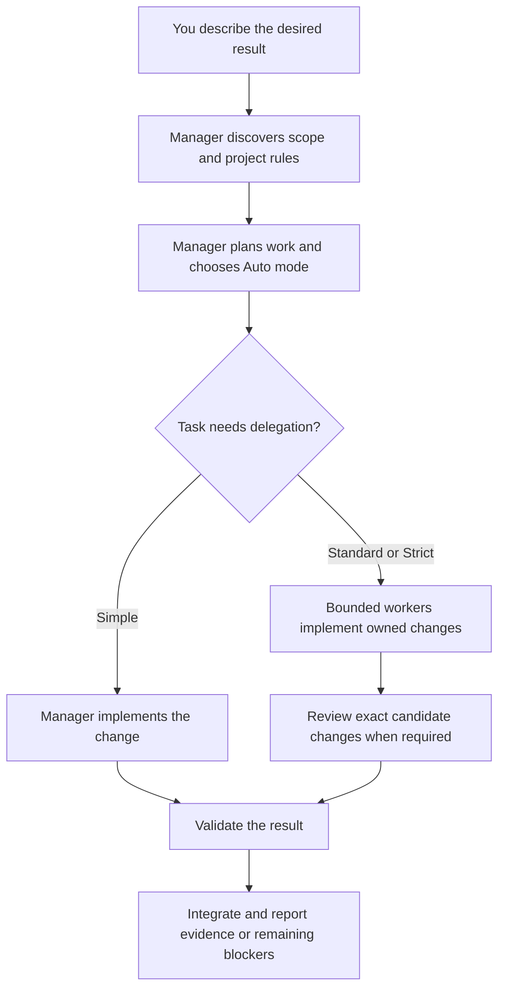

# Lemmings


Lemmings turns a coding request into a checked repository change. You describe the outcome to your agent; that agent manages discovery, implementation, review and integration. Small changes stay small. Larger changes can use independent workers in isolated worktrees, with reviewers checking the actual changes before integration.

The normal interface is a conversation with your agent. The agent runs the bundled tools when needed; you do not need to prepare task JSON or run Python commands yourself.

## How it works



The cycle is **Discover → Plan → Refine → Implement → Verify**. The manager owns decisions and reports; scripts validate recorded decisions and carry out operations. Workers receive a bounded task and relevant context. Reviewers check the candidate against the acceptance criteria. Explorers answer focused questions when more context is needed.

| Mode | When the manager uses it | What it adds |
| --- | --- | --- |
| Simple | One low-risk area | Direct implementation and focused checks |
| Standard | One bounded writer, medium risk or a review requirement | A recorded task, candidate and review when required |
| Strict | Parallel writers, shared contracts/assets, submodules or high risk | Dependency planning, isolated writers, immutable reviews and integration checks at the exact commit |

Auto chooses the mode after discovery and can escalate as risk becomes clear. A small edit does not require a team of agents. Parallel writers need independent ownership and separate workspaces; the manager waits for the whole wave before integration. Missing host capabilities are reported, and delivery is adapted within the task's required guarantees.

## Connect through your agent

Open the target repository in your coding agent and send this request, replacing the two paths:

> Install Lemmings from `<path-to-this-package>` into `<path-to-my-repository>`. Read the package installation instructions, run its installer and doctor, and preserve my existing manual settings. Use the current host defaults. Report whether the skill is ready to use.

If the package is not available locally yet:

> Obtain Lemmings from https://github.com/UnioGame/unigame.ai.lemmings.git in a separate tools directory and install it into this repository. Follow its README, preserve existing settings and verify the installation.

The agent needs filesystem and terminal access, Git and Python 3.10+. Provider TOML discovery additionally needs Python 3.11+. Engine SDKs and extra provider CLIs are optional and are needed only for work that uses them. If a prerequisite is missing, the agent reports it and follows your environment's installation permissions.

The installer adds the repository skill and role definitions, preserves existing v4 manual settings, and verifies the bundle. It does not install engine SDKs or change provider credentials. An active Lemmings task or owned running workspace blocks replacement: finish or safely stop that work before updating the installed copy. Hosts that cache skills may need a new agent session to discover the installation. Plugin hooks are configured separately.

No provider scan, custom profile or telemetry setup is needed to start. Existing manual assignments take priority; otherwise Lemmings uses the current host defaults.

## Work through your agent

Start with the result you want and how to recognize success:

> Use Lemmings to fix the settings window so reopening it does not add duplicate event listeners. Preserve existing behavior and verify the changed lifecycle.

In hosts that support explicit skill invocation, you can start the same request with `$lemmings`. Otherwise ask the agent to use the installed Lemmings skill. These examples are messages to the manager, not special slash commands.

| What you want | Message to the agent |
| --- | --- |
| A small fix | “Use Lemmings to fix this bug. Keep the work proportional and run the focused checks.” |
| Independent parallel work | “Split these independent changes between two isolated workers, preserve my current checkout, review their changes and integrate the passing results.” |
| Provider inventory | “Scan my configured providers and save the available model inventory. Keep manual settings unchanged; do not run paid inference probes.” |
| Profile proposals | “Using that inventory, propose up to three worker/reviewer profiles: economy, balanced and review-focused. Reuse my existing subscriptions and show what is verified and what is unknown.” |
| Save a proposed profile | “Save the proposed balanced profile. Leave the active profile unchanged.” |
| Switch profiles | “Use balanced for new tasks. Keep explicit task assignments and my manual role settings first. Explain any overrides that prevent balanced from taking effect.” |
| Mix subscriptions | “Prepare a profile with workers from my OpenCode Go subscription and a reviewer from my other configured provider. Use discovered IDs and compatible executors.” |
| Inspect engine rules | “Explain which engine and target-platform rules apply to this task, then load only the relevant packs.” |
| Check progress | “Show what is complete, what is running, what is blocked and which checks have passed.” |

The manager turns profile proposals into concrete options; you select which to save or activate. Saving and activation are separate. A scan discovers configuration and catalogue evidence; it does not prove paid access or remaining quota. An inference probe requires an explicit request. Changing a selected profile affects future tasks; active tasks keep their frozen routes and rules.

Profile precedence is: **explicit task pin → project manual settings → personal manual settings → selected generated preset → current host defaults**. On provider capacity failure, the manager follows authorized recovery choices or asks you to choose a concrete alternative. It does not silently substitute an arbitrary model.

At completion, the manager reports the changed files, validation evidence and remaining limitations. If required checks or review cannot finish, the task remains incomplete and the manager explains the blocker.

## Automatic project rules and context economy

CORE contains the common workflow: ownership, permissions, context limits, review and integration evidence. Optional packs contain technology-specific practices. The manager detects the nearest project for the task's paths, including inside a monorepo; it loads only the selected packs. You can explicitly name the technology or build target when detection cannot establish it.

| Pack | What it protects |
| --- | --- |
| [Unity](skills/lemmings/rules/unity.md) | Asset GUIDs and meta files, serialized references, lifecycle, assembly boundaries and independent import caches |
| [Unreal](skills/lemmings/rules/unreal.md) | Reflection and module contracts, Blueprint/binary asset ownership and focused build checks |
| [Godot](skills/lemmings/rules/godot.md) | Scene and UID references, signals, lifecycle and version-appropriate checks |
| [Defold](skills/lemmings/rules/defold.md) | Lua lifecycle, resource URLs, collection loading and native-extension boundaries |
| [Flutter](skills/lemmings/rules/flutter.md) | Widget/state lifecycle, keys, semantics and focused widget checks |
| [Phaser](skills/lemmings/rules/phaser.md) | Scene restart cleanup, listeners/timers, shared textures and browser behavior |
| [PixiJS](skills/lemmings/rules/pixijs.md) | Renderer lifecycle, ticker/GPU resources, shared textures and resize behavior |

[Platform rules](skills/lemmings/rules/platforms.md) add relevant web, mobile, desktop or publishing constraints. The build target is separate from the agent's operating system. Detection does not install SDKs, and a compilation check does not prove visual correctness.

Agents work from specific paths and symbols, skip generated files and caches, and return bounded diagnostics. Dispatch starts at 16 KiB and 12 context references, with frozen ceilings of 32 KiB and 24 references. Checks that already passed are repeated only when changes or unresolved risks justify it. Worktrees isolate writers; shared editor/import state must not defeat that isolation. Cleanup retains dirty, active, unknown or unintegrated work.

## Version and installed copies

The current declared package version is **5.0.0**. [Unity package metadata](package.json), [Python package metadata](pyproject.toml), [Codex plugin metadata](.codex-plugin/plugin.json), the installer and runtime use the same version. The Task/Phase/Review format is **schema v4**; this is a contract version, not the package release number.

Version 5.0.0 adds frozen cumulative budgets with hard ceilings, progress-based repair decisions, configurable workspace pooling, and optional existing/official skill reuse proposals while preserving schema v4 and complete-wave integration. For exact source identity, use the Git commit as well as the version. A repository installation is a copied bundle: updating this source package does not automatically update an existing `.agents` installation.

> Check the Lemmings source version and Git commit, compare them with this repository's installed bundle, and report whether an update is needed. If no Lemmings work is active, update the bundle while preserving manual settings and verify it.

Schema versions before 4 require an explicit replacement; the installer does not silently migrate them.

## CLI reference for agents and maintainers

The commands below are the implementation interface used by the manager. They are useful for automation, diagnostics and manual operation; ordinary use can stay in the agent conversation above.

### Installation and diagnostics


Requires Git and Python 3.10+ for the core CLI. Provider TOML discovery needs Python 3.11+ (`tomllib`); on an older Python the scan reports that limitation without blocking ordinary work. No Unity or external agent CLI is required to install.

From this package:

```text
python skills/lemmings/scripts/install.py --repo <your-repository>
```

Windows and Bash launchers are also provided:

```text
./scripts/install.ps1 -Repo <your-repository>
./scripts/install.sh --repo <your-repository>
```

Then ask the agent: **“Use Lemmings to implement this change and verify the result.”** A small change uses the current agent and current host defaults. The installed command is:

```text
python .agents/skills/lemmings/scripts/run.py doctor
```

Examples below use `lemmings` as shorthand for `python .agents/skills/lemmings/scripts/run.py`. No separate CLI installation is necessary. Add `--repo PATH` when outside the target repository.

The installer copies the self-contained skill and three roles. It preserves existing v4 settings and manual model/effort overrides, fills missing defaults, and rolls back owned files on failure. Existing active runtime, invocation, process or workspace ownership blocks replacement. It never installs engine SDKs or changes provider credentials. Schema versions before 4 require an explicit replacement; they are not silently migrated. Plugin hooks are configured separately.

### Discover existing subscriptions

Ask the manager: **“Scan my configured providers, save the inventory and propose up to three worker/reviewer profiles. Keep my manual profiles first.”**

```text
lemmings models scan
lemmings models scan --offline
lemmings models scan --host-catalog host-catalog.json --output inventory.json
lemmings models inspect --inventory --provider <provider-id> --limit 20
lemmings profiles list
```

Default output is a compact provider/count summary; `models inspect --inventory` returns a bounded provider slice. `models scan --details` explicitly emits the full sanitized snapshot. The scan reads standard Codex/OpenCode configuration and documented catalogs; it sends no inference requests. Generated state is stored in `~/.lemmings/state.json`, with no credential values. Offline/partial scans preserve earlier catalogue evidence as stale and report limitations. When configured or authenticated providers are known, the shared OpenCode cache is restricted to those provider identities; models from unrelated cached vendors are not treated as connected subscriptions. Provider IDs must match exactly: `opencode_go` and `opencode-go` are different config keys. A mismatch produces a diagnostic, not an automatic personal-config rewrite.

| Evidence | Meaning |
| --- | --- |
| configured | Present in local provider/profile settings |
| catalogued | Listed by a catalogue source |
| compatible | Protocol/executor combination is supported |
| authConfigured | Authentication appears configured; access is not proven |
| probed | An explicit targeted access/inference probe succeeded |

A public catalogue does not establish subscription entitlement, current quota, latency or model quality. Models under the same quota group may share one subscription limit. To explicitly test one selected route:

```text
lemmings models probe --route route.json
```

Use a sanitized route object from the scan. This command can consume provider usage; ordinary scan, installation and proposals never call it.

[OpenCode Go](https://opencode.ai/docs/go/) contains models with different protocols. A list of Codex Responses profiles is not the complete Go catalogue. Responses-compatible routes can use Codex CLI; Chat Completions or Messages routes need a compatible OpenCode provider. Missing models can therefore mean an alias/configuration mismatch, an incomplete local catalogue, or executor incompatibility. Inspect these separately before editing configuration. Codex discovery includes visible entries and reasoning variants from `models_cache.json`, named `[profiles.*]`, and standalone `*.config.toml` files. Profiles using the same model retain separate identities. Hidden cache entries and embedded model instructions are excluded. A public Go model ID gets a known protocol only from verified service metadata; newly added IDs remain unknown until their protocol is established.

### switch worker/reviewer profiles

Ask the manager: **“From the discovered routes, prepare economy, balanced and review profiles. Show known tradeoffs and unknowns; save the one I select.”** The manager creates up to three options; there is no hidden CLI model-ranking service.

The manager writes `routes.json` with worker/reviewer/explorer ordered route arrays using actual scanned IDs. It can combine different providers and existing Codex profile names. Each route records hostId, providerId, modelId, executor, protocol and optional variantId/profileName/quotaGroup. Copy evidence from the scan; do not invent model IDs or protocol support.

```text
lemmings models propose --name balanced --routes routes.json --output proposal.json
lemmings models apply --proposal proposal.json --confirm <proposalDigest>
lemmings profiles inspect balanced
lemmings profiles use balanced
```

Saving does not activate a profile. Selecting affects future Tasks and authorizes only its listed ordered fallback chains. It never authorizes arbitrary model substitution or a second simultaneous writer after a failed attempt.

Precedence, highest first:

1. Explicit task model pin.
2. Active project manual role assignments in `.agents/lemmings.json`.
3. Active personal manual assignments in `~/.lemmings/profiles.json`.
4. Explicitly selected generated preset.
5. Current host defaults.

Manual named files use a `profiles` map, with each name containing `roleRoutes` for worker/reviewer/explorer; an optional `activeProfile` selects the manual default. Existing project `modelRoutes` remains supported and retains priority. `profiles inspect` explains the effective sources so a manual pin that masks a generated choice is visible. Values installed by an older v4 release are also preserved: the installer cannot reliably distinguish them from your edits. To let a generated preset control a role, explicitly move or remove that role’s old manual assignment after inspecting its source.

For example, merge this named profile into your personal file after replacing the example IDs with routes reported by your scan. `profileName` refers to an existing Codex profile; the Lemmings preset name is separate.

```json
{
  "schemaVersion": 4,
  "activeProfile": "mixed",
  "profiles": {
    "mixed": {
      "roleRoutes": {
        "worker": [{"hostId": "opencode", "providerId": "YOUR_PROVIDER", "modelId": "YOUR_WORKER_MODEL", "executor": "opencode", "protocol": "chat-completions"}],
        "reviewer": [{"hostId": "codex", "providerId": "YOUR_PROVIDER", "modelId": "YOUR_REVIEW_MODEL", "executor": "codex", "protocol": "responses", "profileName": "YOUR_EXISTING_PROFILE"}],
        "explorer": []
      }
    }
  }
}
```

A new Task can select a preset when its first invocation is persisted:

```text
lemmings invocation create --task docs/tasks/change.task.json --role worker --attempt 1 --expected-revision 0 --preset balanced
```

The manager prepares a valid bounded Task first. `--profile settings.json` still means a configuration file path; `--preset balanced` means a profile name. Effective profile/rules are frozen per Task. Changing the active preset never reroutes an already running task.

Legacy explicit-catalog routing is retained:

```text
lemmings models inspect
lemmings models propose --catalog catalog.json --routes routes.json
lemmings models apply --catalog catalog.json --routes routes.json --confirm <proposalDigest>
```

### run an existing provider as a worker

Native host dispatch is the default. The manager can execute a saved invocation through an installed Codex or OpenCode CLI when a selected route declares that executor:

```text
lemmings run --task docs/tasks/change.task.json --invocation-id <saved-id> --route route.json --dry-run
lemmings run --task docs/tasks/change.task.json --invocation-id <saved-id> --route route.json --output result.json
lemmings invocation accept --task docs/tasks/change.task.json --result result.json --expected-revision <revision>
```

A standalone CLI cannot create a native host agent by itself; a native dispatch request is handed back to the manager/host bridge. External adapters start fresh sessions and enforce role tool restrictions. Unsupported restrictions/protocols fail visibly. Process termination must be confirmed before a replacement writer starts. Launching does not accept a candidate. Offline adapter tests use fake executables and do not prove live subscription access. Codex uses its filesystem sandbox; OpenCode provides tool permissions and permits only declared validation/Git commands for workers. CLI deadlines are enforced; tool-call counts remain instruction budgets when the CLI exposes no hard limiter. Native bridges must declare fresh-session, role, cancellation and no-delegation guarantees. Selected Codex profile connection/effort is carried into an isolated invocation without importing its unrelated tool grants.

On capacity failure, the manager retries one short transient error or reduces context once where appropriate. Otherwise it proposes task-local recovery choices. Existing `models recover propose|apply|advance` keeps the selected ordered chain in the Task. No history transfers between models. See [routing and recovery](skills/lemmings/references/model-routing.md).

Cross review uses distinct provider/model identities, not two variants of one model. If unavailable, the manager records `reviewPolicy: single` and `cross-review-unavailable`; this does not block delivery.

### engine rules load automatically

Core owns orchestration, permissions, ownership, context budgets and evidence. Optional [rule packs](skills/lemmings/rules/manifest.json) own technology-specific practices. Detection follows task paths to the nearest project root, including monorepos. It ignores generated/dependency/cache trees and transitive lockfile dependencies. No SDK is installed by detection.

```text
lemmings rules explain --path GameClient/Assets/UI
lemmings rules explain --path games/browser/src --platform web
lemmings rules explain --path tools/client --technology flutter --platform android
```

The manager stores the selection in Task `ruleSelection` (`paths`, `technologies`, `platforms`) before the first invocation. Explicit selections override detection. Selected refs and content hashes join the existing dispatch budget; unselected packs are not loaded. Platform means the task's build target, not the agent's OS.

| Technology | Example request | Pack focus |
| --- | --- | --- |
| [Unity](skills/lemmings/rules/unity.md) | Fix one UI prefab and its binding | GUID/meta identity, narrow serialized changes, asmdefs, lifecycle, targeted Editor checks, independent Library |
| [Unreal](skills/lemmings/rules/unreal.md) | Change a component used by Blueprint | Reflection/module contracts, binary ownership, OFPA authored assets, UBT/Blueprint checks |
| [Godot](skills/lemmings/rules/godot.md) | Repair a signal or scene reference | Version/C# distinction, UID/import sidecars, NodePath, headless vs visual evidence |
| [Defold](skills/lemmings/rules/defold.md) | Fix collection loading or GUI input | Lua lifecycle, resource URLs, atlases, Bob version, native extensions |
| [Flutter](skills/lemmings/rules/flutter.md) | Fix a widget/state cleanup bug | Actual Flutter SDK detection, existing state architecture, dispose/keys/semantics, focused widget checks |
| [Phaser](skills/lemmings/rules/phaser.md) | Fix a scene that leaks after restart | Direct version evidence, shutdown listeners/timers, shared textures, input/resize/loading checks |
| [PixiJS](skills/lemmings/rules/pixijs.md) | Fix renderer mounting and resize | Version-specific init/destroy, ticker/GPU/shared textures, DPR, browser checks |

[Platform rules](skills/lemmings/rules/platforms.md) add only relevant web/mobile/desktop/publishing constraints. Flutter is not automatically Flame; PixiJS is not automatically a scene/physics engine. Compilation/headless checks do not establish visual correctness. Preserve project conventions and validate the changed risk only.

### isolated parallel work and submodules

Ask the manager: **“Split independent changes into two isolated workers. Preserve the dirty primary checkout and review their exact commit ranges.”**

The manager records an exact repository/backend/base SHA/branch/destination/estimate plan. `workspace prepare` executes that plan; `workspace inspect` explains registry state. Use `codex/` branches by default. A package worktree uses the package's own Git root, not a whole superproject with a package-only size estimate.

```text
lemmings workspace estimate --backend package-worktree --package <package-git-root>
lemmings workspace inspect
lemmings workspace prepare --repo <package-git-root> --task docs/tasks/change.task.json --destination <worktree-path> --branch codex/change --expected-revision <registry-revision>
```

For package provisioning run in the package's own Git root, with `workspace.packagePath: "."`. The recorded Task workspace includes `workspaceId`, `backend`, `managedBy: "lemmings"`, `lifetime`, `repoRoot`, `destination`, `branch`, `estimatedGiB`, `approval` and a reason; Task `baseSha` is an exact commit. Resolve the registry revision with inspect. These values are checked against the actual repository and creation request.

```text
lemmings workspace release --workspace-id <id> --task docs/tasks/change.task.json --task-revision <task-revision> --expected-revision <registry-revision> --action pool
lemmings workspace remove --workspace-id <id> --task docs/tasks/change.task.json --task-revision <task-revision> --expected-revision <registry-revision>
```

Never use force/reset/clean/prune as routine lifecycle actions. A primary, dirty, user-owned, validation, unknown, active or unintegrated worktree cannot be removed automatically. Cleanup requires the canonical Task, matching revision, actual integrated commits and passing declared checks at that commit. A caller boolean is not integration evidence. Failed/cancelled work stays available for diagnosis. Quarantine records uncertainty without deleting files.

The pool retains at most two idle worktrees and 10 GiB per Git common directory. Provisioning above 10 GiB requires recorded authorization. Editors, import caches, ports and browser state belong to independent worker directories. A persistent validation workspace can retain expensive caches; it is not a spare writer checkout. See [workspace lifecycle](skills/lemmings/references/game-projects.md).

### Token economy and checks

Dispatch starts under 16 KiB and 12 hashed references and can expand only to frozen ceilings of 32 KiB, 24 references, and three focused expansions. Initial tool-call grants remain worker 24, reviewer 16, explorer 12; cumulative ceilings are 48, 32, and 24. Read exact symbols/assets and targeted diagnostics; do not load complete scene YAML, binaries, generated bundles, dependency caches or full logs into model context.

Validation returns bounded diagnostics, an omitted-byte count, full-log artifact reference and actual exit status. Truncation never hides failure. Do not repeat passing checks without new changes or unresolved risk. [Context rules](skills/lemmings/references/context-contract.md) and selected packs provide details.

```text
lemmings check --task docs/tasks/change.task.json
lemmings check --all --phase docs/tasks/change.phase.json
lemmings check --distribution
lemmings integration validate --task docs/tasks/change.task.json --expected-revision <revision>
```

Integration validation requires HEAD equal to Task `close.mergeCommit` and a clean source tree before and after checks; only the canonical Task and declared validation outputs may differ. Plain `check` validates contracts; `--distribution` additionally compares installed instructions while allowing explicit model/effort overrides. Telemetry remains optional and offline (`lemmings metrics status`); scans and capacity handling do not depend on it.

Package development checks: `python -B -m unittest discover -s tests`, skill validation, Markdown links, package JSON and `git diff --check`. See [package rules](AGENTS.md) and [roadmap](Documentation~/tasks/ROADMAP.md).
