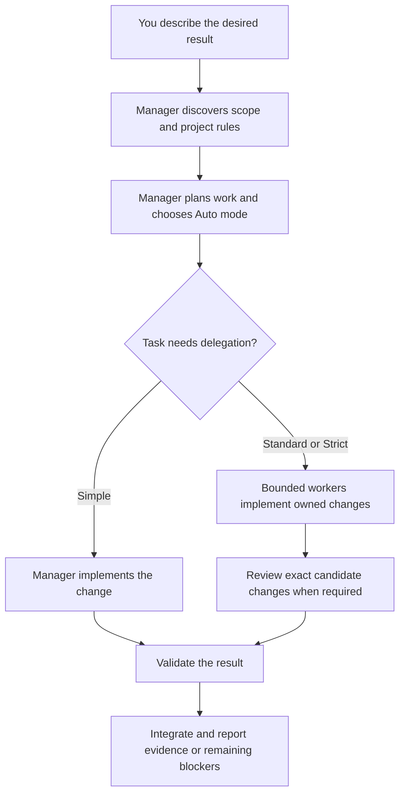
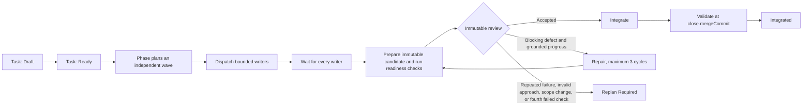

# Lemmings


Lemmings turns a coding request into a checked repository change. You describe the outcome to your agent; that agent manages discovery, implementation, review, and integration. Small changes stay small. Larger changes can use independent workers in isolated worktrees, with reviewers checking the actual changes before integration.

The normal interface is a conversation with your agent. The agent runs the bundled tools when needed; you do not need to prepare task JSON or run Python commands yourself.

## How Lemmings Works



The cycle is **Discover → Plan → Refine → Implement → Verify**. The manager owns decisions and reporting. Workers receive bounded context and ownership; reviewers inspect immutable candidates; explorers answer focused questions.

| Mode | Typical scope | Added control |
| --- | --- | --- |
| **Auto** | Default for ordinary requests | Chooses Simple, Standard, or Strict after discovery and may escalate before completion |
| **Simple** | One low-risk area | Direct implementation and focused validation |
| **Standard** | One bounded writer, medium risk, or required review | Recorded Task, bounded candidate, and review where required |
| **Strict** | Parallel writers, shared contracts/assets, submodules, or high risk | Dependency planning, isolated writers, immutable reviews, and exact-commit integration checks |

Parallel work uses complete waves: dispatch independent tasks with separate ownership, wait for every current writer, then accept and integrate. Dependent work starts after its dependencies are integrated.



Acceptance is the stopping condition: the requested criteria and required checks pass, with no concrete blocking defect in affected behavior. **P0-P2 block acceptance; P3 suggestions do not.** Optional refactoring, style changes, and speculative improvements remain follow-ups. A repeat review checks the fixes and directly affected behavior using existing evidence; it does not restart a full audit. A new candidate readiness digest alone does not require full review. Mode selection considers the task's actual scope, not merely the presence of submodules or integration branches in its repository.

Three repair cycles are a ceiling, not a target, and permit at most four candidate checks: the initial candidate and one after each repair. Before a candidate reviewer receives a budget, `candidate prepare` records the exact candidate SHA, plan/validation digests, worker result, ownership, clean-tree checks, bounded command diagnostics, and explicit executor-unavailable debt. A failed command cannot be masked by debt, and readiness is invalidated when the SHA or requirements change. A repair continues only when it resolves material findings or demonstrably narrows the cause; repeated work moves to `Replan Required`. Acceptance alone is not integration; declared checks must pass while `HEAD` equals the recorded `close.mergeCommit`.

## 5.0.3

The five-stage workflow remains **Discover → Plan → Refine → Implement → Verify**, with less protocol work for agents. `task prepare` builds a schema-v4 Task from an explicit compact brief, `candidate submit` accepts and prepares a worker result without hand-editing state, and candidate review remains recoverable through `review start` and `review submit`.

Hosts with trusted usage receipts keep `host-v1`. Hosts without them can freeze `invocation-v1`, which counts real invocations across retry, repair, recovery, and replan without pretending unknown tool calls were measured. Reviewer identity comes from the saved reviewer route and is used consistently for dispatch and Review.

## 5.0.2

Review stops when acceptance and required checks pass with no concrete blocking defect. P3 suggestions remain optional, repeat reviews focus on repairs, and unchanged evidence is reused. Optional suggestions no longer count as progress on an unresolved blocker.

## Quick Start

The ordinary path uses four manager operations. `task prepare` records the manager's semantic decisions once. `candidate submit` accepts and prepares a worker result. `review start` records the reviewer invocation, and `review submit` constructs and applies immutable Review evidence. The tools manage revisions, Git bindings, digests, and cycle numbers. Repeating an operation reuses saved progress. A malformed report is corrected locally for the same invocation, without restarting implementation or review. Low-level commands remain available for integrations.

Workers can return compact reports: ingestion supplies omitted schema/attempt fields, derives changed paths from Git, and accepts missing empty optional lists. The invocation must still be explicitly identified. Candidate review accepts `id` as `findingId`; priorities, findings, and substantive acceptance/validation evidence are preserved. Missing substantive evidence is requested on its own, not treated as a reason to redo the task.

```text
lemmings task prepare --input task-brief.json --task docs/tasks/change.task.json
lemmings candidate submit --task docs/tasks/change.task.json --invocation-id <worker-id> --result <worker-report.json>
lemmings review start --task docs/tasks/change.task.json --head <candidate-sha>
lemmings review submit --task docs/tasks/change.task.json --result <report.json> --review <allowed-artifact-path.json> --host-receipt <receipt.json>
```

`TaskBrief v1` contains the goal, acceptance, risks, risk-to-test mapping, ownership, minimal working set, declared checks, and an explicit manager decision block for mode, review, workspace, role routes, and accounting mode. The tool hashes references and fills technical Task fields; it never chooses those decisions and never overwrites an existing Task. See [the reusable brief template](skills/lemmings/templates/task-brief.json).

Lemmings requires Git and Python 3.10+. Provider TOML discovery additionally requires Python 3.11+. Engine SDKs and external provider CLIs are optional and are needed only for tasks that use them.

Open the target repository in your coding agent and ask it to install Lemmings from a local package path. If the package is not local, ask it to obtain [the Git repository](https://github.com/UnioGame/unigame.ai.lemmings.git) in a separate tools directory first. The agent should run the installer and `doctor`, preserve manual settings, and report whether the skill is ready.

From the package root, use the launcher for your environment:

```text
python skills/lemmings/scripts/install.py --repo <your-repository>
./scripts/install.ps1 -Repo <your-repository>
./scripts/install.sh --repo <your-repository>
```

Then verify the installed bundle:

```text
python .agents/skills/lemmings/scripts/run.py doctor
```

The installer preserves schema-v4 manual settings and rolls back owned files on failure. Active Lemmings work blocks replacement. Cached hosts may need a new agent session; plugin hooks are configured separately.

For an update, ask the agent to compare the source version and Git commit with the repository bundle, update only when no Lemmings work is active, preserve manual settings, and run `doctor` again.

### Claude Code plugin

The same repository is also a Claude Code plugin. It keeps the shared `skills/lemmings/` workflow and provides Claude-compatible worker, reviewer, and explorer definitions without pinning a model.

Validate or try a local checkout:

```text
claude plugin validate . --strict
claude --plugin-dir .
```

After this repository is published, add its marketplace and install the plugin:

```text
claude plugin marketplace add UnioGame/unigame.ai.lemmings
claude plugin install lemmings@unigame-ai
```

Restart Claude Code after installation, or use `/reload-plugins` when the install summary offers it. The Claude package exposes `/lemmings:lemmings` and the scoped `lemmings-worker`, `lemmings-reviewer`, and `lemmings-explorer` agents.

## Using Lemmings

Start with the result and observable success criteria:

> Use Lemmings to fix the settings window so reopening it does not add duplicate event listeners. Preserve existing behavior and verify the changed lifecycle.

Use `$lemmings` on hosts with explicit skill invocation. Otherwise ask the agent to use the installed Lemmings skill. Useful requests include:

- **Small fix:** “Keep the work proportional and run the focused checks.”
- **Parallel delivery:** “Split these independent changes between two isolated workers, wait for the whole wave, review their exact changes, and integrate the passing results.”
- **Strict workflow:** “Use Strict because this change crosses a shared contract and a submodule. Preserve the dirty primary checkout.”
- **Model routing:** “Scan configured providers without paid probes and propose economy, balanced, and review-focused profiles. Keep manual assignments first.”
- **Project rules:** “Explain which engine and target-platform rules apply, then load only those packs.”
- **Skill reuse:** “Before inventing a repeated workflow, check installed skills and official sources. Recommend whether to reuse, extend, create, or document it.”

Profile precedence is **explicit task pin → project manual settings → personal manual settings → selected generated preset → host defaults**. Presets affect future Tasks; active Tasks keep frozen routes and rules. Recovery stays within the authorized route chain.

## Guarantees and Defaults

### Ownership, Review, and Workspaces

Parallel writers require independent ownership, separate workspaces, resource checks, and available slots. Review covers the immutable commit range; integration checks the exact merged commit. Missing required review or validation leaves the Task incomplete.

The optional pool defaults to two idle worktrees and 10 GiB per Git common directory. Dirty, active, user-owned, unknown, unintegrated, or failed workspaces remain protected. Larger workspaces require recorded authorization; editor state and caches must preserve isolation.

### Bounded Context and Repairs

Initial budgets can be extended only with an unresolved question and evidence of progress. The Task freezes both the initial values and absolute ceilings before its first invocation. Retry, repair, model recovery, and a new invocation share cumulative usage and cannot reset or raise those ceilings.

| Budget | Initial | Absolute ceiling |
| --- | ---: | ---: |
| Dispatch size | 16 KiB | 32 KiB |
| Context references | 12 | 24 |
| Focused context expansions | 1 | 3 |
| Explorer tool calls | 12 | 24 |
| Reviewer tool calls | 16 | 32 |
| Worker tool calls | 24 | 48 |
| Repair cycles | 0 | 3 |

Each invocation receives only the approved remainder. New invocations use `usageAccounting=host-v1`: only a host receipt bound to the invocation and grant may release unused calls; model-authored usage is ignored and a missing or mismatched receipt spends the full grant and locks the role. Historical v5.0.0 invocations retain their legacy read path. Exhaustion preserves the result and stop reason instead of creating a replacement Task to bypass the limit.

### Project Rules

CORE owns orchestration and evidence. The manager detects the nearest project and loads only applicable technology and platform packs; explicit selections override detection. Detection installs no SDK, and headless checks do not prove visual correctness.

| Pack | Primary concerns |
| --- | --- |
| [Unity](skills/lemmings/rules/unity.md) | GUID/meta identity, serialized references, lifecycle, assembly boundaries, and isolated import caches |
| [Unreal](skills/lemmings/rules/unreal.md) | Reflection/module contracts, Blueprint and binary ownership, and focused build checks |
| [Godot](skills/lemmings/rules/godot.md) | Scene/UID references, signals, lifecycle, and version-appropriate checks |
| [Defold](skills/lemmings/rules/defold.md) | Lua lifecycle, resource URLs, collection loading, and native extensions |
| [Flutter](skills/lemmings/rules/flutter.md) | Widget/state lifecycle, keys, semantics, and focused widget checks |
| [Phaser](skills/lemmings/rules/phaser.md) | Scene cleanup, listeners, timers, shared textures, and browser behavior |
| [PixiJS](skills/lemmings/rules/pixijs.md) | Renderer lifecycle, ticker/GPU resources, shared textures, and resize behavior |

[Platform rules](skills/lemmings/rules/platforms.md) add web, mobile, desktop, or publishing constraints for the build target rather than the agent's operating system.

### Existing and Official Skills First

Repeated nontrivial work, user corrections, stable project conventions, or expensive research can become a skill candidate. The manager checks installed skills and then official owner sources, including versions, dependencies, and required tools.

The manager recommends reuse, local extension, creation through `skill-creator`, or a script/document. Changes require the user's choice. If search is unavailable, it reports an incomplete official check and continues without claiming no solution exists.

## Command Reference

The manager normally runs these commands. In the examples, `lemmings` means:

```text
python .agents/skills/lemmings/scripts/run.py
```

Add `--repo PATH` when running outside the target repository. Use `<command> --help` for the complete option set.

### Models and Profiles

Scanning is sanitized and sends no inference request. It can show configuration, catalogue, protocol compatibility, and apparent authentication, but only an explicit probe tests access and may consume provider usage.

```text
lemmings models scan
lemmings models scan --offline
lemmings models inspect --inventory --provider <provider-id> --limit 20
lemmings models probe --route route.json
lemmings profiles list

lemmings models propose --name balanced --routes routes.json --output proposal.json
lemmings models apply --proposal proposal.json --confirm <proposalDigest>
lemmings profiles inspect balanced
lemmings profiles use balanced
```

Saving a proposal does not activate it. Route IDs and protocols must come from discovered evidence. Use `models recover propose|apply|advance` for a recorded Task-local capacity failure; recovery stays inside the authorized ordered route chain.

### Rules and Task Runtime

```text
lemmings rules explain --path GameClient/Assets/UI
lemmings rules explain --path games/browser/src --platform web

lemmings status --task docs/tasks/change.task.json
lemmings runtime status
lemmings runtime activate --task docs/tasks/change.task.json
lemmings runtime deactivate
```

Task selection freezes the resolved profile, rule references, content hashes, reviewer route, and budget policy. `host-v1` verifies host receipts. `invocation-v1` counts invocation creation with default task limits of worker 5, reviewer 7, and explorer 5; replay of the same invocation is free, and model-authored usage is never trusted. Low-level invocation commands persist this boundary and accept only a matching result:

```text
lemmings invocation create --task docs/tasks/change.task.json --role worker --attempt 1 --expected-revision 0 --preset balanced
lemmings candidate prepare --task docs/tasks/change.task.json --expected-revision <revision>
lemmings invocation create --task docs/tasks/change.task.json --role reviewer --subject-kind candidate --attempt 1 --expected-revision <revision>
lemmings invocation extend --task docs/tasks/change.task.json --kind toolCalls --role worker --amount 8 --unresolved-question "<question>" --progress "<evidence>" --expected-revision <revision>
lemmings run --task docs/tasks/change.task.json --invocation-id <saved-id> --route route.json --output result.json
lemmings invocation accept --task docs/tasks/change.task.json --result result.json --host-receipt host-receipt.json --expected-revision <revision>
lemmings repair start --task docs/tasks/change.task.json --review docs/tasks/reviews/candidate.json --progress "<concrete progress>" --plan "<next bounded change>" --expected-revision <revision>
lemmings review apply --task docs/tasks/change.task.json --review docs/tasks/reviews/candidate.json --expected-revision <revision>
```

External runners require a compatible declared executor and protocol. Unsupported restrictions fail visibly; launching a process does not accept its candidate.

### Workspaces

```text
lemmings workspace estimate --backend package-worktree --package <package-git-root>
lemmings workspace inspect
lemmings workspace prepare --task docs/tasks/change.task.json --destination <worktree-path> --branch codex/change --expected-revision <revision>
lemmings workspace release --workspace-id <id> --task docs/tasks/change.task.json --task-revision <task-revision> --expected-revision <registry-revision> --action pool
lemmings workspace remove --workspace-id <id> --task docs/tasks/change.task.json --task-revision <task-revision> --expected-revision <registry-revision>
```

Cleanup requires canonical Task evidence and actual integrated commits. Force, reset, clean, and prune are not routine lifecycle operations.

### Validation and Distribution

```text
lemmings doctor
lemmings check --task docs/tasks/change.task.json
lemmings check --all --phase docs/tasks/change.phase.json
lemmings integration validate --task docs/tasks/change.task.json --expected-revision <revision>
lemmings check --distribution
lemmings metrics status
```

Validation preserves the real exit status and returns bounded diagnostics with a full-log artifact reference. Integration validation requires a clean tree and `HEAD` equal to `close.mergeCommit` before and after every declared check. Telemetry is optional and offline.

## Version and Reference

The package is **5.0.3** across [Unity](package.json), [Python](pyproject.toml), [Codex plugin](.codex-plugin/plugin.json), [Claude Code plugin](.claude-plugin/plugin.json), installer, and runtime metadata. Task, Phase, and Review remain **schema v4**. Older schemas require explicit replacement. Repository bundles are copies and do not update with the source; use the Git commit for exact identity.

Authoritative details live in:

- [Contracts and lifecycle](skills/lemmings/references/contracts.md)
- [Context and cumulative budgets](skills/lemmings/references/context-contract.md)
- [Model routing and recovery](skills/lemmings/references/model-routing.md)
- [Game projects and workspace lifecycle](skills/lemmings/references/game-projects.md)
- [Existing and official skill reuse](skills/lemmings/references/skill-reuse.md)
- [Optional offline telemetry](skills/lemmings/references/telemetry.md)

Package maintainers should also follow [package rules](AGENTS.md) and the [roadmap](Documentation~/tasks/ROADMAP.md).
