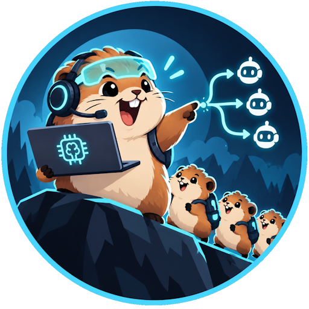
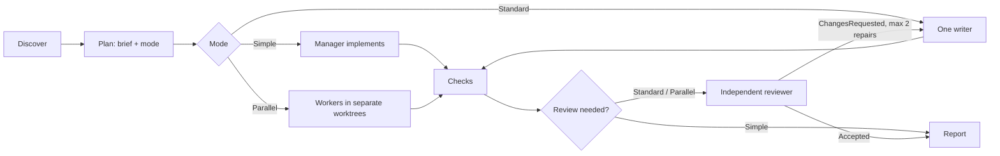

# Lemmings



Lemmings turns a coding request into a checked repository change. You describe the outcome to your agent. The agent acts as the manager: it scopes the work, implements it or hands it to workers, has an independent reviewer check the result when the risk calls for it, and reports the evidence. Small changes stay small.

The whole process lives in one skill, [`skills/lemmings/SKILL.md`](skills/lemmings/SKILL.md), and works without Python. An optional standard-library helper covers what an agent should not improvise: isolated worktrees, scope checks, and running a role on another host CLI.

## How it works



| Mode | Use it for | Process |
| --- | --- | --- |
| **Simple** | One low-risk area | The manager changes the code and runs the checks. |
| **Standard** | Medium risk, a public contract, or wider validation | One writer, then one independent read-only reviewer. |
| **Parallel** | Independent pieces with separate owned paths | One worker per worktree, a complete wave, review of each piece, and checks on the merged result. |

The only task contract is a short Markdown brief: goal, acceptance criteria, owned paths, checks, risks, and starting context. The reviewer blocks only on P0–P2 findings, each with a concrete failure scenario. P3 findings are follow-ups. A task gets at most two repair rounds before the manager reports the blocker.

## Install

### Claude Code plugin

```text
claude plugin marketplace add UnioGame/unigame.ai.lemmings
claude plugin install lemmings@unigame-ai
```

For a local checkout, use `claude --plugin-dir .`. The plugin provides `/lemmings:lemmings` and the `lemmings-worker`, `lemmings-reviewer`, and `lemmings-explorer` agents.

### Codex or a repository-local install

From this package, with Python 3.10+:

```text
python skills/lemmings/scripts/install.py --repo <your-repository>
./scripts/install.sh --repo <your-repository>
./scripts/install.ps1 -Repo <your-repository>
```

This copies the skill to `<repo>/.agents/skills/lemmings` and the Codex agents to `<repo>/.codex/agents/`. If the install fails, it restores the previous files. Without Python, copy `skills/lemmings/` and the matching files from `agents/` yourself.

## Using it

Ask your agent to use Lemmings and state the result you want, with observable acceptance criteria. You can name a mode ("use Lemmings Parallel") or leave it to Auto.

Optional helper commands:

```text
python .agents/skills/lemmings/scripts/run.py doctor
python .agents/skills/lemmings/scripts/run.py workspace create <slug>
python .agents/skills/lemmings/scripts/run.py scope --base <sha> --owned src/feature
python .agents/skills/lemmings/scripts/run.py dispatch reviewer --brief brief.md --host claude --model opus
```

See [references/helper.md](skills/lemmings/references/helper.md) for details.

## Cross-host routing

By default, each role runs as a native subagent of the host you are working in, using that host's default model. To run a role elsewhere, for example Claude reviewing work managed in Codex, assign it in `.agents/lemmings.json`:

```json
{
  "roles": {
    "reviewer": {"host": "claude", "model": "opus", "effort": "high",
                 "fallback": [{"host": "codex", "model": "gpt-5.6-sol"}]}
  }
}
```

`lemmings dispatch` starts a fresh session of the target CLI (`codex exec`, `claude -p`, or `opencode run`) with that CLI's own login and configuration. It enforces read-only access for reviewers and explorers and applies a deadline. It records the run under `<git-common-dir>/lemmings/runs/` and checks which model actually answered. A model mismatch is reported as an error. Fallback routes are used only when a CLI is missing, fails, or times out.

## Game projects

Engine rules for Unity, Unreal, Godot, Defold, Flutter, Phaser, and PixiJS live in [`skills/lemmings/rules/`](skills/lemmings/rules/). `workspace estimate` includes the Unity `Library` that a new copy will rebuild. Workspaces above 10 GiB need your approval. See [game-projects.md](skills/lemmings/references/game-projects.md).

## Telemetry

[`packages/lemmings-telemetry`](packages/lemmings-telemetry/) is an optional, offline package that summarizes dispatch run logs by role, host, and model: runs, failures, fallbacks, verdicts, time, and tokens.

```text
pip install ./packages/lemmings-telemetry
lemmings-telemetry --repo . --days 30
```

## Development

```text
python -m pytest -q
python scripts/build_agents.py        # regenerate agents/*.toml from agents/*.md
```

Release notes: [Documentation~/releases](Documentation~/releases/).
