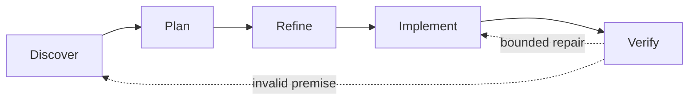

# Lemmings

**Proportional orchestration for agent-assisted repository delivery.**

Lemmings guides work through **Discover → Plan → Refine → Implement → Verify** and adds process only when risk justifies it. A small change stays small; parallel or contract-sensitive delivery gains isolation, independent review, and integration evidence.

## Contents

- [Core idea](#core-idea)
- [Modes](#modes)
- [Workspace strategy](#workspace-strategy)
- [Install](#install)
- [Use the skill](#use-the-skill)
- [Optional tooling](#optional-tooling)
- [Advanced enforcement](#advanced-enforcement)
- [Artifacts](#artifacts)
- [Documentation](#documentation)

## Core idea

The **Smart Skill** is the product and the only orchestrator. It selects a mode, assigns models, creates the necessary artifacts, delegates bounded work, operates Git, reviews the real candidate range, and verifies integration.

Python tooling is optional. It validates contracts, finalizes tracked Task quality, reports status, estimates workspace size, and records opt-in timing telemetry. Optional hooks enforce decisions already made by the skill; neither tooling nor hooks implement a second workflow.



## Modes

| Mode | Best fit | Added structure |
| --- | --- | --- |
| **Simple** | One local, low-risk change | No Lemmings artifact by default |
| **Standard** | One writer with meaningful implementation or validation | Task, candidate commit, immutable high-model Review |
| **Strict** | Parallel writers, shared contracts, serialized assets, submodules, code generation, or leased resources | Phase baseline, frozen contracts, isolated writers when required, leases, Reviews, integration evidence |

`auto` is the default. Explicit user mode and model choices remain in force until changed.

## Workspace strategy

Lemmings chooses the narrowest safe backend:

| Backend | Use when |
| --- | --- |
| `current` | One safe serial writer can use the current checkout |
| `code-worktree` | Code needs an isolated branch without launching the full validation environment |
| `package-worktree` | The owned change is fully contained in a package or submodule repository |
| validation clone | A persistent, warmed full-project environment must own integration validation |

For large game repositories, the default is **hybrid**: writers use code or package worktrees, while one warmed validation clone owns full-project checks. Only one editor or batch process uses shared validation resources at a time, and shared serialized files have one owner.

The pipeline, subagents, and safe serial work in the current checkout need no special workspace approval. Concurrent implementation writers never share that checkout; each needs an isolated workspace. Before creating any code worktree, package worktree, or full validation clone, Lemmings estimates the new workspace; estimates above **10 GiB** require approval in Unity and non-Unity repositories alike. If approval is declined, the pipeline continues in the current checkout where safe, and only workspace-dependent work becomes `Blocked` when no safe fallback exists.

## Install

Run the bootstrap from the Lemmings package or external clone.

### PowerShell

```powershell
pwsh -File <lemmings>/scripts/install.ps1 -Repo <repository>
```

### Bash

```bash
bash <lemmings>/scripts/install.sh --repo <repository>
```

The bootstrap:

- copies the self-contained skill to `.agents/skills/lemmings`;
- creates or merges `.codex/lemmings.json` with portable game-workspace defaults;
- records where optional tooling lives;
- supports embedded packages, submodules, external clones, and linked worktrees;
- does not install Python, change `PATH`, enable hooks, stage files, or create commits.

PowerShell uses `-DryRun`, `-Force`, and `-Project <path>`; Bash uses `--dry-run`, `--force`, and `--project <path>`. The project argument is optional when exactly one supported game project is found, and required when discovery finds zero or multiple candidates. Python is **not required** for skill-only operation.

## Use the skill

Skill controls are written in chat, not executed in a shell:

```text
$lemmings auto
$lemmings status

$lemmings models worker=gpt-5.6-luna:max
$lemmings models task TASK-17 worker=gpt-5.6-sol:medium

$lemmings workspace auto
$lemmings workspace current
$lemmings workspace isolated
$lemmings workspace status
$lemmings workspace task TASK-17 isolated
```

Enable or disable Lemmings for the current task with `$lemmings on` and `$lemmings off`. Discover/Plan/Refine, orchestration, and independent review use `gpt-5.6-sol:high`. A bounded Ready worker defaults to `gpt-5.6-luna:max`; large-context, multi-subsystem, or failed-Luna implementation escalates to `gpt-5.6-terra:max`. Sol Medium/High/Max are explicit worker pins only and always override automatic routing. Plan defects return to Refine without worker escalation. Explorer uses Luna High, validator uses Terra Medium, and evidence summarization uses Luna Medium.

Example:

```text
$lemmings auto
Implement TASK-17 and verify the resulting commit range.
```

Lemmings discovers the affected scope, explains its selected mode and workspace, refines the task to `Ready`, implements it, and verifies the actual candidate or fix head.

## Optional tooling

When Python 3.10+ is available, run tooling directly from the discovered Lemmings root—installation is unnecessary:

```bash
python -m lemmings check
python -m lemmings status
python -m lemmings workspace estimate
python -m lemmings workspace inspect
```

`workspace estimate` defaults to the Git worktree estimate. Pass `--backend package-worktree --package <repo-relative-package>` for the target package, or `--backend unity-clone` after full-clone validation has been selected. Every isolated backend reports whether its estimated copy exceeds the approval threshold.

Telemetry is local, off by default, and independent of the orchestration mode:

```bash
python -m lemmings metrics basic
python -m lemmings metrics stage discover --task TASK-17
python -m lemmings metrics finish --outcome completed --task TASK-17
python -m lemmings metrics report --benchmark
```

Tool discovery checks the Git-common environment file, then the repo-relative profile path, then package metadata. If Python or tooling is unavailable, the skill continues with native Git and shell capabilities.

## Advanced enforcement

The optional [hook layer](hooks/hooks.json) can enforce:

- reviewer read-only behavior;
- writer path ownership;
- selected model assignment;
- bounded subagent context;
- candidate and validation evidence;
- isolated-workspace binding;
- privacy-bounded telemetry events.

Hooks are **not enabled by bootstrap**. They fail open on telemetry recording errors; safety policy remains separate from telemetry. See [game-project workspace policy](skills/lemmings/references/game-projects.md) for resource ownership and large-repository constraints.

Six optional [agent profiles](agents) cover orchestrator, worker, reviewer, validator, explorer, and summarizer.

## Artifacts

| Artifact | Created when | Owns |
| --- | --- | --- |
| **Task** | Standard and Strict | Goal, acceptance, ownership, models, workspace decision, execution handoff, commits, validation debt, review reference, close evidence |
| **Phase** | Strict only | Baseline, frozen shared contracts, task DAG, leases, integration branch and close evidence |
| **Review** | Independent baseline or candidate review | Immutable subject SHA/range, high-model verdict, findings and validation |

`Accepted` means the latest candidate range passed independent review. `Integrated` additionally means the accepted work was merged and integration validation passed. **Accepted ≠ Integrated.**

## Documentation

- [Smart Skill](skills/lemmings/SKILL.md)
- [Artifact contracts](skills/lemmings/references/contracts.md)
- [Game-project workspaces](skills/lemmings/references/game-projects.md)
- [Telemetry and benchmarking](skills/lemmings/references/telemetry.md)
- [Task, Phase, and Review templates](Documentation~/tasks/templates)
